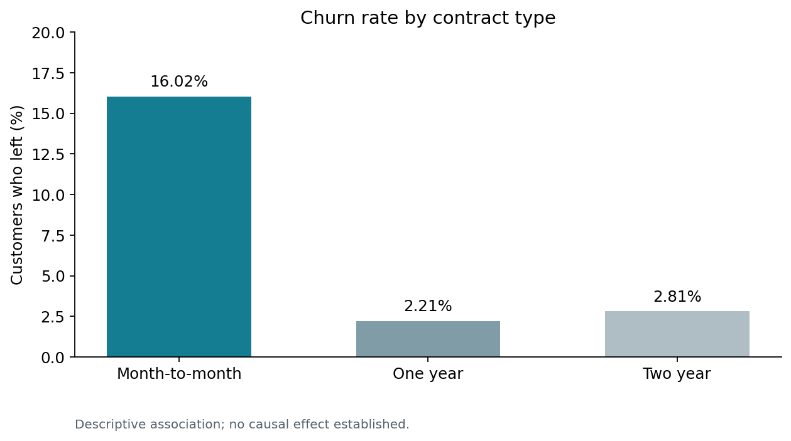
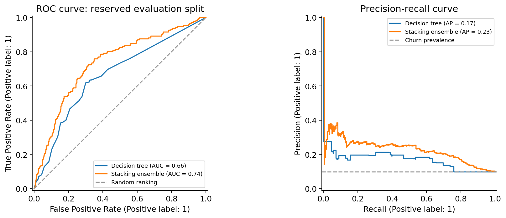

# Customer Churn Analysis and Predictive Modeling

**Jack Magee | Business Analytics coursework | Python**

An analysis of 6,000 customer records exploring churn patterns, comparing predictive models, and translating results into questions for a retention strategy.

**Start here:** [Executed analysis notebook](customer_churn_analysis.ipynb) · [Python script](analysis.py) · [Revision notes](CHANGES.md)

## Business question

Which customer characteristics are associated with leaving, and how well can models identify customers at risk of churn?

## Key findings

- **9.92%** of customers in the labeled dataset left: 595 of 6,000.
- Observed churn was **16.02%** for month-to-month contracts, compared with **2.21%** for one-year and **2.81%** for two-year contracts.
- Contract type and internet service were the two highest-ranked features by F1 permutation importance for the selected decision tree.
- Random forest and logistic regression achieved ROC-AUC values of approximately **0.758** on the reserved evaluation split, but all models missed most churners at the default threshold.



The contract differences are associations, not evidence that moving customers into annual plans will cause churn to fall. Customer feedback and a controlled retention experiment would help test that idea.

## Methods and skills

- **Data preparation:** schema checks, missing-value handling, categorical encoding, and scaling.
- **Exploratory analysis:** churn rates by contract, payment method, and tenure.
- **Model comparison:** logistic regression, decision tree, and random forest with five-fold stratified cross-validation and grid search.
- **Feature engineering and ensembles:** spending intensity, service count, contract/payment interaction, and a stacking experiment.
- **Evaluation:** F1, precision, recall, ROC-AUC, average precision, and permutation importance.

**Tools:** Python, pandas, NumPy, scikit-learn, Matplotlib, and Jupyter-compatible notebooks.

## Reproduced results for the portfolio revision

The baseline models use a fixed, stratified 70/30 split: 4,200 training rows and 1,800 evaluation rows. Model tuning occurs within the training portion. All models below use the same evaluation rows; classification metrics use the default 0.5 probability threshold.

| Model | Mean cross-validation F1 |
| --- | ---: |
| Logistic regression | 0.1690 |
| Decision tree | 0.2003 |
| Random forest | 0.0141 |

The decision tree was selected among the initial models using cross-validation F1. The ensemble was a separate pre-specified experiment, not selected by optimizing the evaluation results.

| Model | ROC-AUC | Average precision | Precision | Recall | F1 |
| --- | ---: | ---: | ---: | ---: | ---: |
| Always-stay baseline | 0.5000 | 0.0989 | 0.0000 | 0.0000 | 0.0000 |
| Logistic regression | 0.7575 | 0.2671 | 0.4667 | 0.0393 | 0.0725 |
| Decision tree | 0.6627 | 0.1684 | 0.1724 | 0.0843 | 0.1132 |
| Random forest | 0.7583 | 0.2526 | 0.5000 | 0.0056 | 0.0111 |
| Stacking ensemble | 0.7356 | 0.2319 | 0.1667 | 0.0056 | 0.0109 |

The always-stay model achieves **90.11% accuracy** while detecting zero churners. This illustrates why accuracy alone is misleading for this imbalanced dataset. The revised stacking experiment did not improve on the simpler models' ranking performance. ROC-AUC is a ranking measure, not a percentage of correct predictions.



Full metrics, including accuracy, are available in [model_metrics.csv](results/model_metrics.csv).

## Business interpretation

The analysis identifies customer groups worth investigating and demonstrates a workflow for comparing churn models. It does **not** establish a production-ready targeting model or a profitable retention policy. A next iteration should evaluate class weighting and thresholds within training/validation data, include outreach costs and customer value, and test on fresh data.

## Run the project

Tested with **Python 3.12.14**. From this project directory:

```bash
python -m venv .venv
source .venv/bin/activate
python -m pip install -r requirements.txt
python analysis.py
```

On Windows, activate the environment with `.venv\Scripts\activate` instead. The notebook can also be opened in an existing Jupyter environment using the same dependencies.

Place `customer_retention_training.csv` and `test_features.csv` in `data/`. The downloadable working package includes the supplied CSVs; the proposed GitHub copy contains code and aggregate results. See [data notes](data/README.md) for source-status details.

The run regenerates charts and metric tables in `results/` and writes **1,000 churn probabilities** to `results/predictions_final.csv`. Those generated IDs are input row numbers, not verified customer IDs. The unlabeled input has no outcomes, so prediction accuracy cannot be evaluated.

## Revision and validation notes

This portfolio revision was prepared with AI assistance from Jack's submitted coursework. The unchanged original is preserved in the downloadable package. See [CHANGES.md](CHANGES.md) for the exact presentation and modeling changes.

All revised notebook code cells were executed sequentially in a clean Python process. Input schemas, prediction counts and probability bounds were checked. The new results replace inconsistent narrative scores in the original submission; the original saved stacking AUC of 0.7848 is not claimed as reproduced because the encoder and evaluation design changed.

For stacking, preprocessing belongs to each base estimator's pipeline. scikit-learn's target encoder cross-fits training encodings, and each stacking fold fits its own preprocessing. [Technical reference](https://scikit-learn.org/stable/auto_examples/preprocessing/plot_target_encoder_cross_val.html).

This evaluation is retrospective: the coursework already explored the labeled dataset. The source, collection dates, synthetic/real status, and redistribution terms of the supplied data remain unconfirmed. Results need validation on fresh data before operational use.
